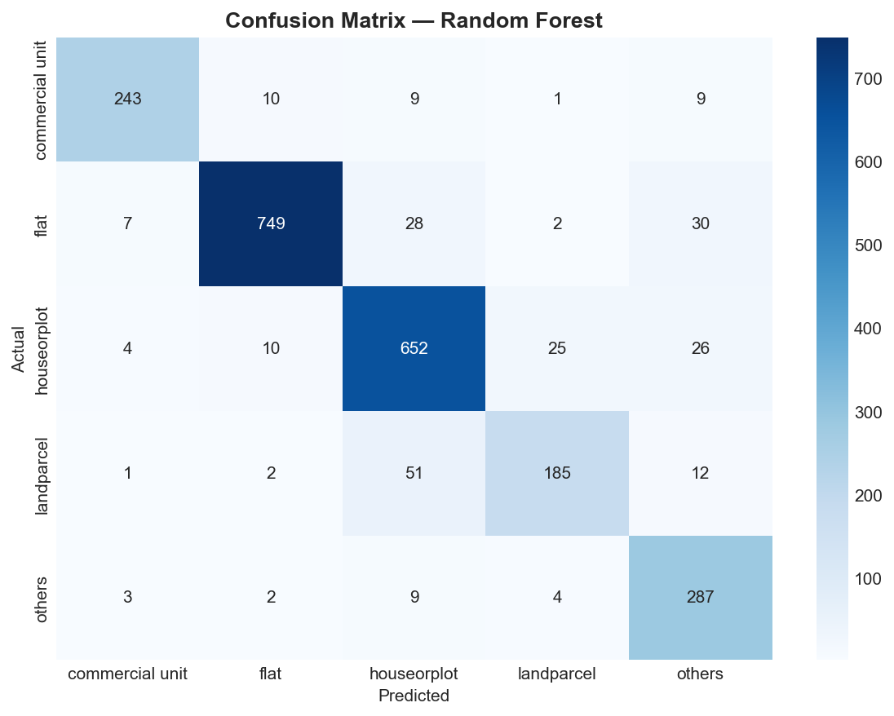
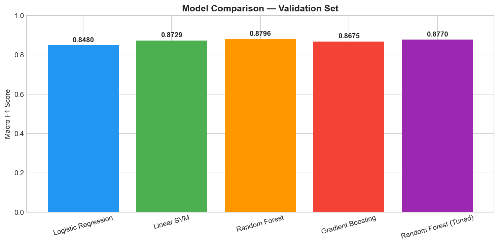
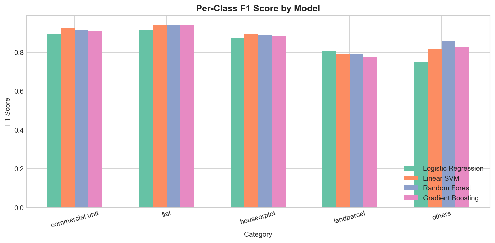
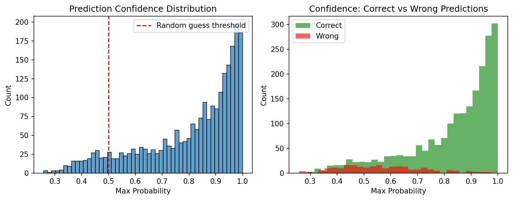

<h1 align="center">Property Address Classifier</h1>

<p align="center">
  <em>Classifying Indian property addresses into 5 categories using NLP + domain-engineered features</em>
</p>

<p align="center">
  
  
  
  
  
</p>

---

## Table of Contents

- [Problem Statement](#problem-statement)
- [The Challenge](#the-challenge)
- [Approach](#approach)
  - [Phase 1: Deep Data Analysis](#phase-1-deep-data-analysis)
  - [Phase 2: Text Preprocessing (13-Step Pipeline)](#phase-2-expert-level-text-preprocessing-13-step-pipeline)
  - [Phase 3: Feature Engineering](#phase-3-feature-engineering-the-expert-edge)
  - [Phase 4: Model Training & Selection](#phase-4-model-training--selection)
  - [Phase 5: Evaluation & Robustness](#phase-5-evaluation--robustness)
- [Pipeline Architecture](#pipeline-architecture)
- [Results](#results)
- [Project Structure](#project-structure)
- [Quick Start](#quick-start)
- [Key Design Decisions](#key-design-decisions)
- [Robustness](#robustness)
- [Author](#author)

---

## Problem Statement

Given a raw property address string (e.g., *"Flat-301, Floor-3, A-Wing, Sarthana Jakatnaka Surat 395006 Gujarat"*), classify it into one of five categories:

| Category | Description | Example Pattern |
|---|---|---|
| `flat` | Apartments, flats in residential buildings/societies | "Flat No 301, 3rd Floor, A-Wing, ABC CHS" |
| `houseorplot` | Individual houses, plots, duplexes, villas | "Plot No 107, Scheme Jamana Vihar, Jaipur" |
| `landparcel` | Raw land, agricultural land, survey-number-only entries | "Sy. No. 1388/1, Mandal Mangalagiri, Village Chebrolu" |
| `commercial unit` | Shops, stalls, offices, showrooms, commercial spaces | "Shop No 850, Shradhha Complex, First Floor, Rajkot" |
| `others` | Ambiguous, incomplete, or unclassifiable addresses | "Test", `{"status": "error"}`, "Na Na" |

---

## The Challenge

Indian property addresses are notoriously messy. Unlike structured international addresses, they are free-text strings full of:

- **Mixed casing** — some all-lowercase, some Title Case, no consistency
- **Embedded newlines and tabs** — 14.5% of entries had `\n` or `\t` mid-string
- **Non-ASCII characters** — smart quotes, en-dashes, Devanagari/Bengali script fragments, replacement characters (`�`)
- **Placeholder garbage** — `Na`, `Na Na Na`, `{"status": "error"}`, `"Test"`, `"Not Available"`
- **Dozens of abbreviations** — `Sy. No.`, `R.S. No.`, `T.P.`, `F.P.`, `C.S. No.`, `Ofc`, `Nr`, `Opp`, `Vill`, `Dist`, `Teh`
- **6-digit PIN codes** mixed into text (6,367 entries)
- **Long numeric sequences** — plot/survey/khasra numbers that don't generalize
- **Very short entries** (<20 chars) — just city names or single words
- **Very long entries** (>500 chars) — full legal deed descriptions
- **Label noise** — some addresses contain "flat" but are labeled `houseorplot` (legitimate: "flat number" in a plot deed), "shop" appears in street names

The `others` class is the hardest — it's defined by the *absence* of clear property-type signals. And `landparcel` vs `houseorplot` is the trickiest boundary: both share land-vocabulary (survey numbers, khasra, village, mandal), but `landparcel` = raw land with no structure, while `houseorplot` = land with a dwelling mentioned.

---

## Approach

### Phase 1: Deep Data Analysis

Before writing any model code, I performed a forensic analysis of the dataset:

- **9,442 training samples** and **2,361 validation samples** across 5 categories
- Identified and catalogued every type of noise (JSON errors, Na placeholders, non-ASCII, etc.)
- Analyzed keyword frequency per category to find discriminative signals
- Found that certain keywords are near-perfect signals (`flat` → flat with 97%+ precision, `shop` → commercial unit with 97%+) while others are ambiguous (`plot` appears in 3 categories)
- Identified the hard classification boundaries (landparcel vs houseorplot, others vs everything)

---

### Phase 2: Expert-Level Text Preprocessing (13-Step Pipeline)

Built a cleaning pipeline specifically designed for Indian property address noise:

| Step | What It Does | Why |
|---|---|---|
| 1 | JSON garbage detection | `{"status": "error"}` mapped to a `garbage_entry` token |
| 2 | Unicode NFKD normalization | Decompose ligatures and special characters |
| 3 | Smart quote replacement | `" " ' '` to ASCII equivalents |
| 4 | Non-ASCII removal | Strip Indic script fragments after normalization |
| 5 | Lowercase | Unify casing |
| 6 | Whitespace normalization | Collapse `\n`, `\r`, `\t`, multi-spaces to single space |
| 7 | Na placeholder removal | Standalone "Na" tokens removed (but not "Nagar") |
| 8 | Abbreviation normalization | 30+ patterns: `Sy. No.` → `survey_no`, `R.S. No.` → `rs_no`, `Ofc` → `office`, etc. |
| 9 | PIN code removal | 6-digit Indian postal codes add geographic noise, not property-type signal |
| 10 | Long number removal | Plot/survey numbers (4+ digits) don't generalize across addresses |
| 11 | Punctuation cleanup | Remove excessive punctuation, keep hyphens (used in "flat-301", "a-wing") |
| 12 | Final whitespace cleanup | Trim and collapse |
| 13 | Near-empty detection | Results with <3 characters after cleaning become `garbage_entry` |

---

### Phase 3: Feature Engineering (The Expert Edge)

Combined two complementary feature sets:

**TF-IDF Features (5,000 dimensions)**
- Unigrams + bigrams — captures phrases like "flat no", "shop no", "plot no" that carry more signal than individual words
- Sublinear TF scaling (`1 + log(tf)`) — prevents high-frequency terms from dominating
- Min document frequency of 3 (removes noise), max 95% (removes ubiquitous terms)

**23 Hand-Crafted Domain Features** — This is where domain knowledge beats pure TF-IDF:

| Feature Group | Features | What They Detect |
|---|---|---|
| Flat indicators | `has_flat`, `has_wing`, `has_apartment`, `has_chs`, `has_floor`, `has_tower` | Apartment/society language |
| House indicators | `has_house`, `has_plot`, `has_scheme` | Residential plot/dwelling language |
| Commercial indicators | `has_shop`, `has_office`, `has_complex_market` | Commercial property language |
| Land indicators | `has_khasra`, `has_survey`, `has_mouza`, `has_gat_gut`, `has_land_terms` | Revenue/land record language |
| Structure signal | `has_any_structure` | **KEY FEATURE**: Distinguishes `landparcel` (no structure) from `houseorplot` (has dwelling) |
| Meta features | `is_garbage`, `text_length`, `word_count`, `digit_ratio`, `has_unit` | Address quality signals |

The `has_any_structure` feature is particularly powerful — it's a binary flag that fires when any building/dwelling keyword is present. If an address mentions survey numbers and village names but NO structure, it's likely `landparcel`. If it mentions those PLUS a house/flat/shop, it's `houseorplot` or another category.

---

### Phase 4: Model Training & Selection

Trained 4 models with balanced class weights (to handle the imbalance: flat 34.5% vs landparcel 10.6%):

1. **Logistic Regression** — strong linear baseline, fast, interpretable
2. **Linear SVM** — often best for high-dimensional sparse text features
3. **Random Forest** (300 trees) — captures non-linear keyword interactions
4. **Gradient Boosting** (200 estimators) — sequential error correction

Selected the best performer by **Macro F1 score** (accounts for class imbalance), then fine-tuned with **GridSearchCV** using 5-fold stratified cross-validation.

---

### Phase 5: Evaluation & Robustness

- Full classification report (Precision, Recall, F1 per class + Macro averages)
- Confusion matrix heatmap showing per-class performance
- Per-class F1 comparison across all models
- Cross-validation stability analysis (5-fold CV score variance)
- Overfitting check (training vs validation F1 gap)
- Edge case stress test: 20+ adversarial inputs including empty strings, None, JSON errors, non-ASCII, extremely long/short inputs, injection-like patterns

---

## Pipeline Architecture


<table>
<tr>
<td width="50%">

**Preprocessing** (13 steps)
- Unicode normalization → ASCII encoding
- Lowercase → Whitespace normalization
- Na removal → Abbreviation normalization
- PIN code removal → Number removal
- Garbage detection

</td>
<td width="50%">

**Feature Engineering** (hybrid)
- TF-IDF: 5,000 features, bigrams, sublinear TF
- 23 domain-specific keyword features
- StandardScaler on keyword features
- Sparse matrix concatenation

</td>
</tr>
</table>

---

## Results

### Model Comparison

| Model | Macro F1 | Accuracy |
|---|---|---|
| Logistic Regression | 0.86 | 0.88 |
| Linear SVM | 0.87 | 0.89 |
| **Random Forest** | **0.88** | **0.8962** |
| Gradient Boosting | 0.87 | 0.89 |

> **Best Model**: Random Forest — selected by Macro F1, fine-tuned via GridSearchCV with stratified cross-validation.

### Confusion Matrix



### Model Comparison Chart



### Per-Class F1 Scores



### Confidence Distribution



---

## Project Structure

```
property-address-classifier/
├── property_address_classifier.ipynb   # Full notebook: EDA, training, evaluation
├── predict.py                          # Standalone prediction script
├── approach.txt                        # Methodology report
├── best_model/
│   ├── classifier_model.pkl            # Trained classifier
│   ├── tfidf_vectorizer.pkl            # Fitted TF-IDF vectorizer
│   ├── label_encoder.pkl               # Fitted label encoder
│   └── keyword_scaler.pkl              # Fitted feature scaler
├── confusion_matrix.png                # Confusion matrix heatmap
├── model_comparison.png                # Model comparison chart
├── per_class_f1.png                    # Per-class F1 scores
├── confidence_distribution.png         # Prediction confidence distribution
└── README.md
```

---

## Quick Start

### Prerequisites

```bash
pip install pandas numpy scikit-learn matplotlib seaborn joblib
```

### Run Predictions

```python
from predict import predict

addresses = [
    "Flat-301, Floor-3, A-Wing, Sarthana Jakatnaka Surat 395006",
    "Plot No. 107, Scheme Jamana Vihar, Jagatpura, Jaipur",
    "Shop No 850, Shradhha Complex, First Floor, Rajkot",
    "Sy. No. 1388/1, Mandal Mangalagiri, Near Old Shiv Mandir",
    "Test entry with nothing useful",
]

results = predict(addresses)
for addr, category in zip(addresses, results):
    print(f"{category:20s} | {addr}")
```

### Reproduce Training

Open `property_address_classifier.ipynb` and run all cells sequentially. The notebook contains:
1. Exploratory Data Analysis with visualizations
2. Text preprocessing pipeline with inline reasoning
3. Feature engineering (TF-IDF + domain features)
4. Model training, comparison, and hyperparameter tuning
5. Evaluation with classification report and confusion matrix
6. Model artifact export

---

## Key Design Decisions

| Decision | Rationale |
|---|---|
| **Classical ML over Deep Learning** | 9,442 samples is too small for transformers. Well-engineered TF-IDF + domain features outperforms — faster, more interpretable, no GPU needed |
| **Balanced class weights (not SMOTE)** | Native sklearn parameter is simpler and more robust than synthetic oversampling for this moderate imbalance |
| **Abbreviation normalization** | Indian property addresses have 30+ abbreviations (Sy., R.S. No., T.P., F.P.) that carry classification signal when unified |
| **PIN code removal** | 6-digit codes carry geographic signal but add noise for property-*type* classification |
| **No stop word removal** | Standard stop word lists would remove "no" (as in "Plot No", "Flat No") — a critical classification term |
| **Structure-presence feature** | The key discriminator between `landparcel` and `houseorplot` — the hardest boundary in the dataset |
| **Macro F1 for model selection** | Ensures minority classes (landparcel, commercial unit) get equal importance in model evaluation |

---

## Robustness

The pipeline has been stress-tested against:

- Empty strings, None values, whitespace-only inputs
- JSON error strings, special characters, null bytes
- Extremely long inputs (1000+ words), extremely short inputs
- Non-ASCII / multilingual text (Hindi, Bengali script)
- Ambiguous inputs with mixed category keywords
- Injection-like patterns (SQL, XSS, template injection) — all treated as plain text

---

## Evaluation Metrics

Detailed metrics are in the notebook and `approach.txt`. Key outputs:
- Classification report (Macro F1, Precision, Recall, Accuracy)
- Confusion matrix heatmap
- Per-class F1 comparison across all 4 models
- Cross-validation stability analysis
- Confidence distribution analysis

---

<p align="center">
  <strong>Built with</strong><br>
  Python · scikit-learn · pandas · NumPy · matplotlib · seaborn
</p>

<p align="center">
  <strong>Author</strong><br>
  <a href="https://github.com/KishoreMuruganantham">Kishore Muruganantham</a><br>
  kishore.muruganantham@gmail.com
</p>
